# Overview

This projects create a CICD pipeline using Azure pipeline that hosting a pre-trained sklearn model that predict housing prices in Boston.

## Project Plan
Project plan will be in two parts.
1. Trello board: https://trello.com/b/6Lt2Xwam/devops-project2
2. Spreadsheet with plan: included in this repository called project-management.xlsx

## Instructions
Image below shows the architecture of the project. The project uses Github for source control, Github Actions for CI, Azure Pipeline for CD, and Paas for hosting the app. 
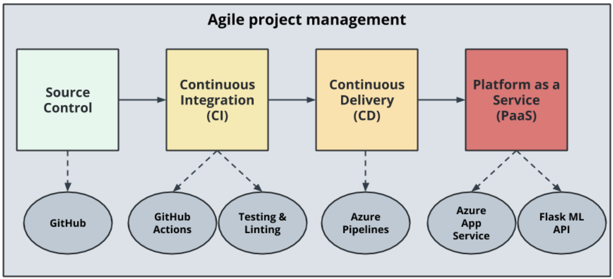

To run the project, first we need to clone the project into Azure cloud shell.
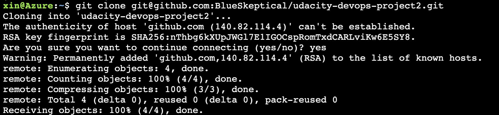

And then make sure the app is deployed to Azure App Service. The image below shows tha the app is running on Azure App Service.
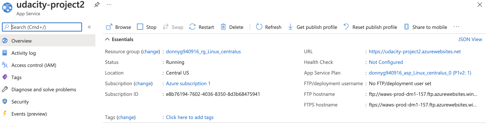

We can run `make all` command from the `Makefile` to check if the app passes all the tests.
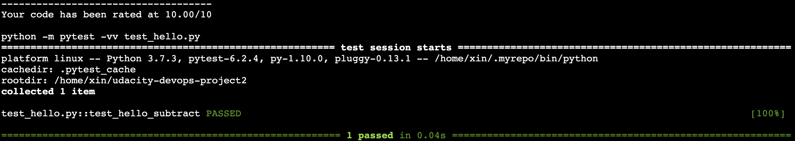

Everytime we commit a change to the repository. The Github Actions will be triggered and test the project.
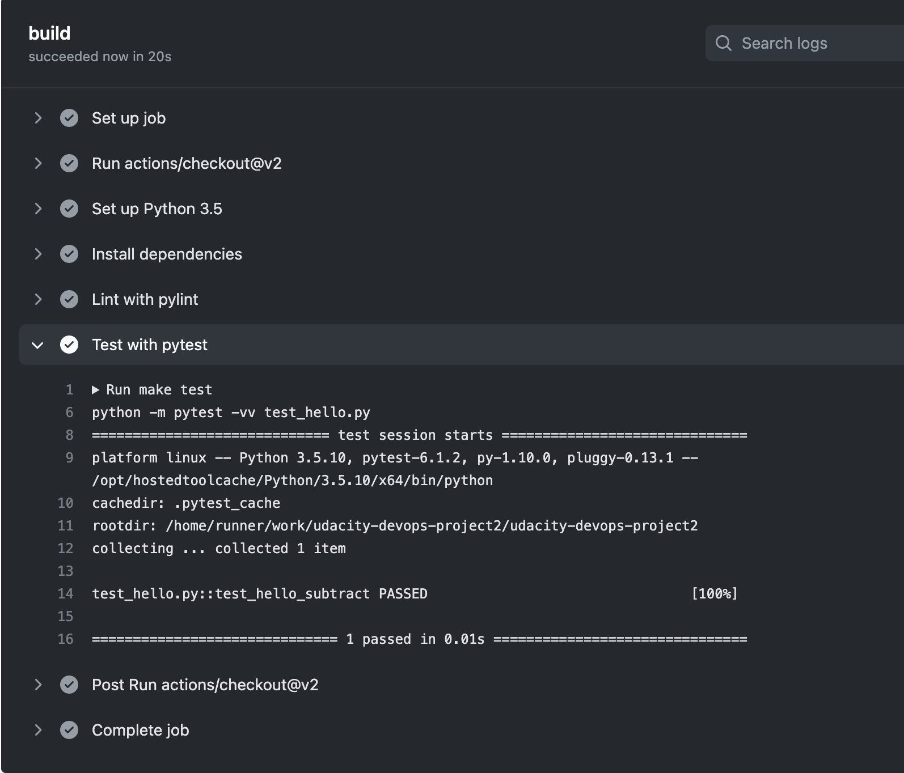

The image below shows that the project is successfully deployed using Azure Pipeline.
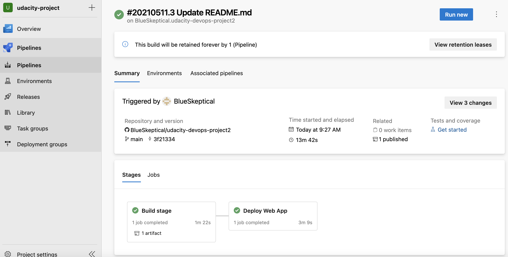

The image below shows that the project is running after redeploy using Azure Pipeline.
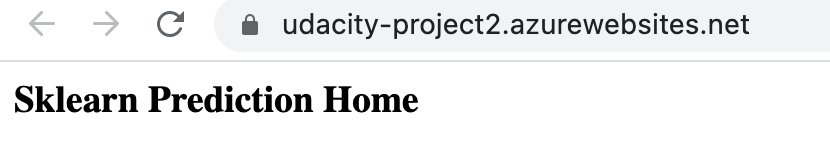

We can run the app by running `.\make_predict_azure_app.sh`. Below is the result we expect to get.
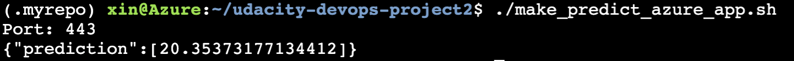

The image below shows the stream logs for the app.
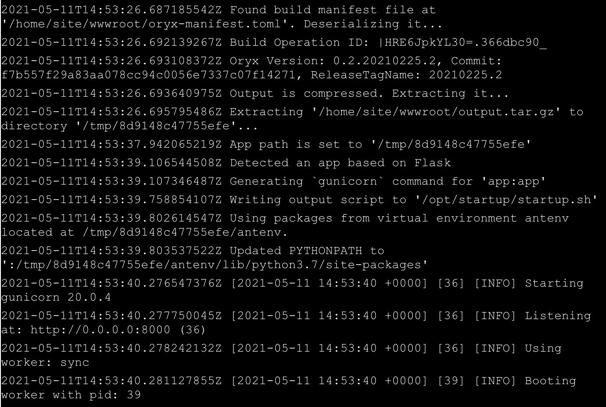

Below are images when we do a load testing using locust. To run the locust test, simply run `locust` in the root directory.
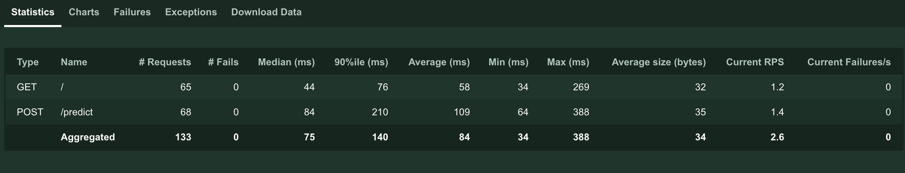
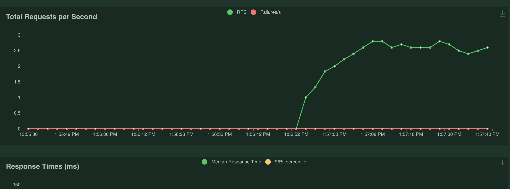
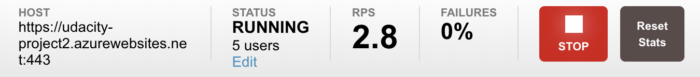
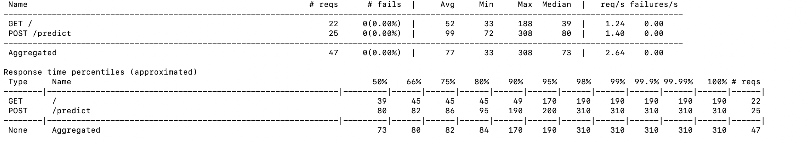
> 

## Enhancements

The project can be improved by adding more automatical testing such as load test or API test to the pipeline, and we can also create a UI for the project. So everytime we change a code, Azure will automatcailly testing everything we need to ensure a quality release.

## Demo 

If you want to see a quick demo about the project, please visit https://youtu.be/yk27-F0QQg0 for a demo on Youtube.

